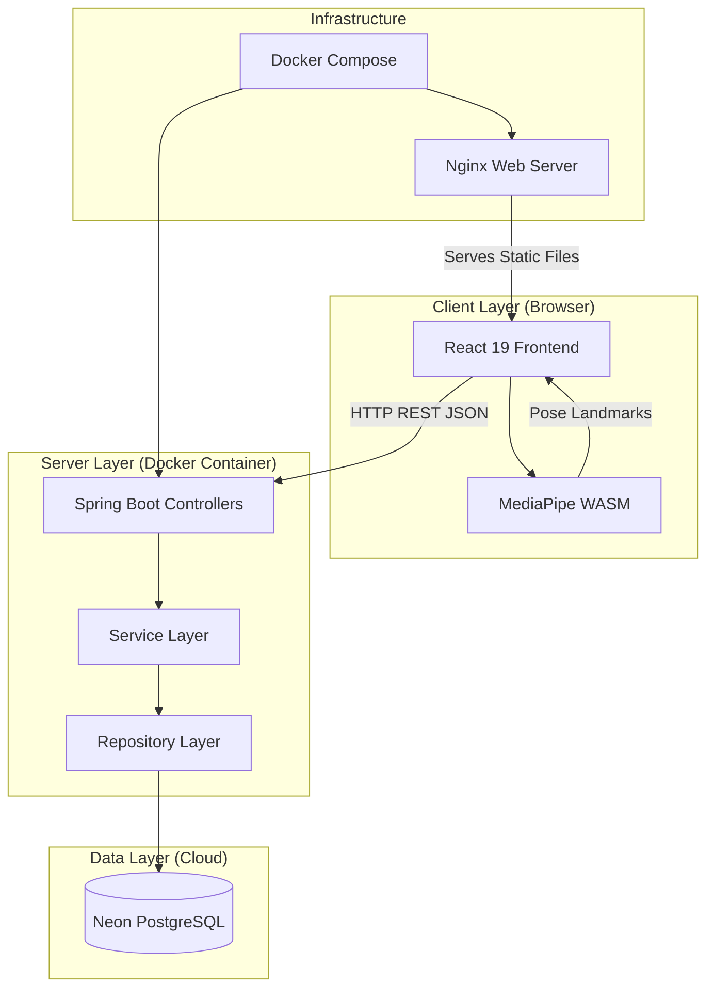
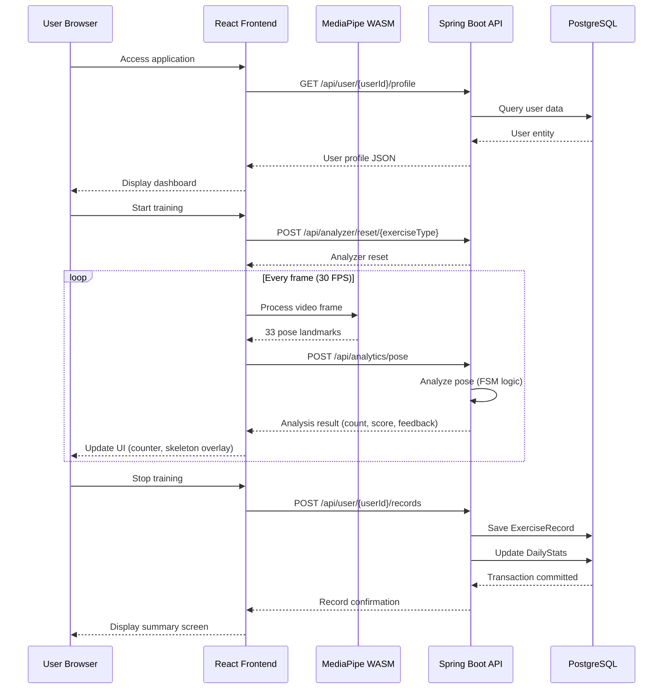
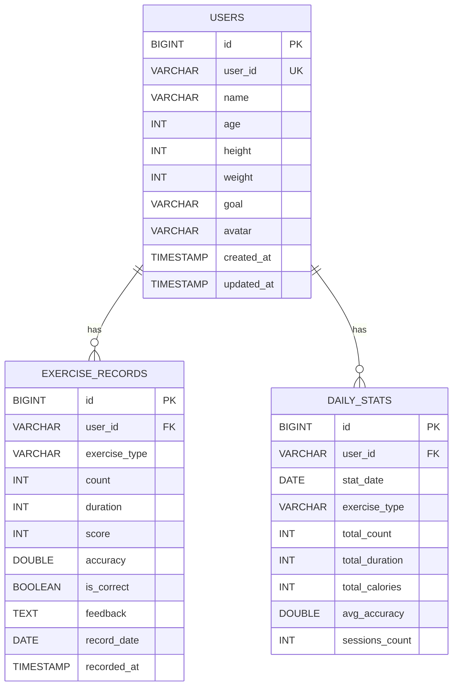

# Project Report: FitnessAI 

## 1) Project Team Details
**Project Name:** FitnessAI - Intelligent Personal Trainer System
**Course**: Java Enterprise Application Development
**Team Number**: Team 10

| Team Member  | Matriculation Numbers | Contact Number | Email Address            |
| ------------ | --------------------- | -------------- | ------------------------ |
| Hongzhen Ren | 2351458               | 15268038220    | hongzhenren409@gmail.com |
| Shu Yu       | 2352979               | 13328168575    | 2486789817@qq.com        |
| Yanwei Huang | 2353117               | 15144043132    | 2353117@tongji.edu.cn    |

---

## 2) System Functionalities and Features

FitnessAI is a **multi-tiered, production-grade web application** built on the Jakarta EE (Spring Boot 3.2.0) platform, designed to deliver intelligent, real-time fitness guidance through computer vision and biomechanical analysis.

### 2.1 Core Functionalities

#### A. Real-Time Pose Analysis Engine
*   **Technology Stack:** MediaPipe Pose (WASM) on client-side, Spring Boot REST API for server-side analysis.
*   **Implementation Details:**
    *   The system detects **33 skeletal landmarks** (shoulders, elbows, hips, knees, ankles, etc.) at 30 FPS.
    *   Frontend: `usePoseDetection.ts` hook manages the `requestAnimationFrame` loop, sending frames to MediaPipe's WASM module.
    *   Backend: REST endpoint `POST /api/analytics/pose` receives landmark JSON and delegates to exercise-specific analyzers.
    *   Supported exercises are dynamically handled via **Factory Pattern** (`PoseAnalyzerFactory`):
        *   `SquatAnalyzer` - Monitors hip-knee-ankle angle (threshold: 140°)
        *   `PushupAnalyzer` - Tracks elbow flexion and torso alignment
        *   `PlankAnalyzer` - Measures core stability via shoulder-hip-ankle linearity
        *   `JumpingJackAnalyzer` - Detects vertical displacement and arm elevation

#### B. Intelligent Feedback System
*   **Finite State Machine (FSM) Logic:**
    *   Each analyzer (e.g., `SquatAnalyzer`) implements a state machine with states: `UP`, `DOWN`, `DESCENDING`, `ASCENDING`.
    *   **Anti-Jitter Mechanism:** `consecutiveUpFrames` and `consecutiveDownFrames` counters require **2-3 consecutive frames** (configurable via `REQUIRED_FRAMES`) before confirming a state transition, preventing false positives from camera noise.
    *   **Cooldown Period:** After counting a repetition, a `COOLDOWN_FRAMES` (10 frames ≈ 0.33 seconds) prevents duplicate counts.
*   **Scoring Algorithm:**
    *   Squat Example: Score = `max(70, 100 - max(0, kneeAngle - 90))`. Deeper squats (smaller angles) yield higher scores.
    *   Real-time feedback messages are dynamically generated: Good! Squat position is correct, please stand up to complete the movement (*"很好！下蹲姿势正确，请站起来完成动作"*).

#### C. Dual Training Modes
*   **Free Mode:** 
    *   No time or repetition constraints.
    *   Users can manually reset counters via the reset button.
*   **Plan Mode:** 
    *   Structured workouts defined in frontend (`TrainingModeSelector.tsx`).
    *   **Easy:** 2 sets × 10 reps (Squats), 1 set × 8 reps (Pushups)
    *   **Medium:** 3 sets × 15 reps (Squats), 2 sets × 12 reps (Pushups)
    *   **Hard:** 4 sets × 20 reps (Squats), 3 sets × 15 reps (Pushups)
    *   Rest intervals (30-60 seconds) are displayed via frontend timers, with an option to skip rest if desired.

#### D. Data Persistence & Analytics
*   **Backend API Endpoints:**
    *   `POST /api/user/{userId}/records` - Saves exercise record to database (invalid records with count < 3 and duration < 30 are automatically filtered)
    *   `GET /api/user/{userId}/records` - Retrieves user's historical exercise records
    *   `GET /api/user/{userId}/stats/today` - Returns today's statistics aggregated by exercise type
    *   `GET /api/user/{userId}/dashboard` - Returns personalized dashboard data (calories, progress, historical data)
*   **Dashboard Visualization:**
    *   Frontend uses **Recharts** library to render:
        *   Line Chart: "Activity Trends" (count over time)
        *   Bar Chart: "Calorie Consumption" (recent 30 days)
        *   Pie Chart: Exercise type distribution
*   **Historical Data:**
    *   Stored in **Neon Cloud PostgreSQL** with automatic persistence via Spring Data JPA.
    *   `@Transactional` annotations ensure atomic saves of exercise records.
    *   **Data Quality Control:** Invalid records (count < 3 and duration < 30 seconds) are automatically filtered at save time and not written to the database, ensuring data quality without manual cleanup.

#### E. User Profile Management
*   **User Entity:** Stores `height`, `weight`, `goal` (e.g., "Weight Loss", "Muscle Gain").
*   **BMI Calculation:** `BMI = weight(kg) / (height(m))²` computed in frontend.
*   **Calorie Estimation:** Uses MET (Metabolic Equivalent of Task) values:
    *   Squats: 5.0 MET
    *   Pushups: 8.0 MET
    *   Formula: `Calories = MET × weight(kg) × duration(hours)`

### 2.2 Supported Exercises

The system supports four types of exercises with different detection methods:

| Exercise | Type | View Support | Detection Method | Key Landmarks |
|----------|------|--------------|------------------|---------------|
| Squat (深蹲) | Count-based | Front | Hip-knee-ankle angle monitoring | Landmarks 23-24 (hips), 25-26 (knees), 27-28 (ankles) |
| Pushup (俯卧撑) | Count-based | Front + Side | Elbow flexion and shoulder height tracking | Landmarks 11-12 (shoulders), 13-14 (elbows), 15-16 (wrists) |
| Plank (平板支撑) | Time-based | Front + Side | Core stability via shoulder-hip-ankle linearity | Landmarks 11-12 (shoulders), 23-24 (hips), 27-28 (ankles) |
| Jumping Jack (开合跳) | Count-based | Front | Vertical displacement and arm elevation | Landmarks 15-16 (wrists), 11-12 (shoulders), 27-28 (ankles) |

**Implementation Files:**
*   `SquatAnalyzer.java` - Monitors hip-knee-ankle angle with threshold of 140°
*   `PushupAnalyzer.java` - Tracks elbow flexion angle and torso alignment
*   `PlankAnalyzer.java` - Measures linearity of shoulder-hip-ankle line
*   `JumpingJackAnalyzer.java` - Detects vertical displacement and arm elevation changes

---

## 3) User Manual & Deployment

### User Manual

**Scenario 1: Starting a Training Plan**
1. **Home Screen:** Upon launching the app, the user sees the dashboard with daily stats.

   

2. **Mode Selection:** Click "Start Training". A modal appears offering "Free Mode" or "Plan Mode". Select "Plan Mode" -> "Medium".

   

3. **Plan Preview:** A summary of the "Medium" plan (e.g., 3 sets of squats, 2 sets of pushups) is displayed. Click "Start".

   

4. **Exercise Interface:** The camera activates. The AI overlays a skeleton on the user. As the user performs a squat, the counter increments, and a progress bar updates.

   

5. **Rest & Completion:** Between sets, a rest timer appears (can be skipped if desired). Upon finishing, a detailed training summary is displayed with comprehensive statistics.

   

**Scenario 2: Viewing Statistics**

1. **Historical Data:** Users can browse past training records

   

**Scenario 3: Free Mode Training**
1.  **Select Free Mode:** From the training mode selector, choose "Free Mode" instead of a structured plan.
2.  **Exercise Selection:** Select desired exercise type (Squat, Pushup, Plank, or Jumping Jack).
3.  **Training:** Perform exercises at own pace without time or repetition constraints.
4.  **Manual Reset:** Users can reset counters at any time using the reset button.
5.  **Completion:** Stop training to view summary statistics.

**Scenario 4: Changing User Profile**
1.  **Access Settings:** Click the settings icon in the header or navigate to Settings modal.
2.  **Update Information:** Modify user profile fields:
    *   Name, Age
    *   Height (cm), Weight (kg)
    *   Fitness Goal (Weight Loss, Muscle Gain, Shape, Maintain Health)
    *   Avatar emoji
3.  **Save Changes:** Click "Save" to persist changes via `PUT /api/user/{userId}/profile` API.
4.  **BMI Calculation:** System automatically calculates BMI using formula: `BMI = weight(kg) / (height(m))²`.
5.  **Calorie Estimation:** Based on updated weight, calorie burn estimates are recalculated for future training records.

### Deployment and Configuration

**Prerequisites:**
*   **Docker Desktop** (Windows/Mac) or **Docker Engine** (Linux) - Version 20.10 or later
*   **Docker Compose** - Version 1.29 or later (included with Docker Desktop)
*   **Optional for local development:**
    *   Node.js 16+ (for frontend development)
    *   Java JDK 17+ (for backend development)
    *   Maven 3.6+ (for backend builds)

**Deployment Steps:**

1.  **Clone Repository:**
    ```bash
    git clone https://github.com/traveler703/FitnessAI.git
    cd FitnessAI
    ```

2.  **Environment Configuration:**
    
    The `docker-compose.yml` file is pre-configured with environment variables for the Neon Cloud PostgreSQL database.
    
3.  **Build and Launch:**
    
    Run the following command in the root directory:
    ```bash
    docker-compose up --build
    ```
    
    This command will:
    *   Build the backend Docker image (multi-stage build with Maven)
    *   Build the frontend Docker image (multi-stage build with Node.js and Nginx)
    *   Start both containers with proper dependencies
    *   Execute health checks on the backend container

4.  **Verify Deployment:**
    
    *   **Backend Health Check:** Visit `http://localhost:8080/actuator/health` - should return `{"status":"UP"}`
    *   **API Status:** Visit `http://localhost:8080/api` - should return API information
    *   **Swagger UI:** Visit `http://localhost:8080/swagger-ui.html` - should display interactive API documentation
    *   **Frontend:** Open browser to `http://localhost:3000` - should display the FitnessAI welcome screen

5.  **Service Access:**
    *   **Frontend Application:** `http://localhost:3000` (Nginx serves React build)
    *   **Backend API:** `http://localhost:8080` (Spring Boot application)
    *   **Swagger Documentation:** `http://localhost:8080/swagger-ui.html`
    *   **OpenAPI JSON:** `http://localhost:8080/v3/api-docs`
    *   **Actuator Health:** `http://localhost:8080/actuator/health`
    *   **Actuator Metrics:** `http://localhost:8080/actuator/metrics`

**Health Check Configuration:**

The Docker Compose file includes health checks for the backend service:
```yaml
healthcheck:
  test: ["CMD", "wget", "-q", "--spider", "http://localhost:8080/actuator/health"]
  interval: 30s
  timeout: 10s
  retries: 3
  start_period: 40s
```

This ensures the container is only marked as healthy when the Spring Boot Actuator health endpoint responds successfully.

**Troubleshooting:**

*   **Port Conflicts:** If ports 3000 or 8080 are in use, modify the port mappings in `docker-compose.yml`
*   **Database Connection Issues:** Verify network connectivity to Neon Cloud (requires internet connection)
*   **Container Build Failures:** Ensure Docker has sufficient disk space (at least 2GB free)
*   **Frontend Not Loading:** Check browser console for errors; ensure API URL is correctly configured
*   **Backend Startup Errors:** Check logs with `docker-compose logs backend` for detailed error messages

---

## 4) System Architecture and Components

The system follows a modern **Client-Server Architecture** utilizing containerization and microservices principles.

### 4.1 Overall Architecture



### 4.2 Frontend Architecture & Components

**Component Hierarchy:**
```
App.tsx
├── WelcomeScreen.tsx (Dashboard)
│   └── StatsPanel.tsx (Statistics Charts)
├── ExerciseSelector.tsx (Exercise Type Selection)
├── TrainingMode.tsx (Mode Selection Modal)
├── CameraView.tsx (Main Exercise Interface)
│   └── usePoseDetection.tsx (Pose Detection Hook)
├── TrainingSummary.tsx (Post-Workout Summary)
├── SettingsModal.tsx (User Profile Management)
├── SystemMonitor.tsx (Backend Metrics Display)
└── Header.tsx (Navigation)
    └── Toast.tsx (Notifications)
```

The React frontend consists of 10 major components, each responsible for specific functionality:

1. **WelcomeScreen.tsx** - Initial landing page with daily statistics dashboard
2. **StatsPanel.tsx** - Displays real-time exercise statistics (count, score, accuracy, feedback)
3. **ExerciseSelector.tsx** - Allows users to select exercise type (squat, pushup, plank, jumping_jack)
4. **TrainingMode.tsx** - Mode selection interface (Free Mode vs Plan Mode with difficulty levels)
5. **CameraView.tsx** - Main exercise interface with real-time camera feed, skeleton overlay, and pose visualization
6. TrainingSummary.tsx** - Post-workout summary screen showing training statistics and achievements
7. **SettingsModal.tsx** - User profile management (height, weight, goal, avatar customization)
8. **SystemMonitor.tsx** - Displays backend system metrics from Spring Boot Actuator (memory, CPU, uptime)
9. **Header.tsx** - Navigation header with theme toggle and settings access
10. **Toast.tsx** - Notification component for user feedback messages

### 4.3 Backend Architecture & APIs

**Layered Architecture:**

```
Controller Layer (REST API)
    ↓
Service Layer (Business Logic)
    ↓
Repository Layer (Data Access)
    ↓
Database (PostgreSQL)
```

**Detailed Component Structure:**

1.  **Controller Layer** (`com.fitnessai.controller`):
    *   `ExerciseController` - Handles pose analysis requests
    *   `UserController` - User profile and record management, dashboard data
    *   `MainController` - API status and health checks

2.  **Service Layer** (`com.fitnessai.service`):
    *   `UserService` - User profile operations, record persistence, dashboard data calculation

3.  **Analyzer Layer** (`com.fitnessai.analyzer`):
    *   `PoseAnalyzer` (abstract base class) - Common pose analysis logic
    *   `PoseAnalyzerFactory` - Factory pattern for analyzer instantiation
    *   `SquatAnalyzer`, `PushupAnalyzer`, `PlankAnalyzer`, `JumpingJackAnalyzer` - Exercise-specific analyzers

4.  **Repository Layer** (`com.fitnessai.repository`):
    *   Spring Data JPA repositories extend `JpaRepository`
    *   `UserRepository`, `ExerciseRecordRepository`, `DailyStatsRepository`

5.  **Model Layer** (`com.fitnessai.model`):
    *   JPA entities with `@Entity` annotations
    *   Relationships defined with `@OneToMany`, `@ManyToOne`

6.  **Configuration Layer** (`com.fitnessai.config`):
    *   `CorsConfig` - Cross-Origin Resource Sharing configuration
    *   `DatabaseHealthIndicator` - Custom Actuator health check for database connectivity

**Detailed description of 3 main controllers:**

**ExerciseController (`/api`)**

*   `GET /api/exercises` - Returns list of supported exercises with descriptions and instructions
*   `POST /api/analytics/pose` - Real-time pose analysis endpoint (receives landmarks, returns analysis result)
*   `POST /api/analyzer/reset/{exerciseType}` - Resets analyzer state for specified exercise type
*   `GET /api/recommendations` - Returns personalized exercise recommendations (optional userId parameter)

**UserController (`/api/user`)**

*   `GET /api/user/{userId}/profile` - Retrieves user profile (creates default if not exists)
*   `PUT /api/user/{userId}/profile` - Updates user profile (name, age, height, weight, goal, avatar)
*   `POST /api/user/{userId}/records` - Saves exercise record to database
*   `GET /api/user/{userId}/records` - Gets user's historical exercise records
*   `GET /api/user/{userId}/stats/today` - Retrieves today's statistics aggregated by exercise type
*   `GET /api/user/{userId}/stats/today/{exerciseType}` - Gets today's count for specific exercise type
*   `GET /api/user/{userId}/dashboard` - Returns personalized dashboard data (calories, progress, historical data)
*   `GET /api/user/admin/cleanup/preview` - Previews invalid records (records with count < 3 and duration < 30 seconds) - Note: Invalid records are automatically filtered at save time and not written to database
*   `DELETE /api/user/admin/cleanup` - Deletes invalid records (admin function for legacy data cleanup)

**MainController**

*   `GET /api` - API status check endpoint
*   `GET /api/health` - Health check endpoint (returns UP status and uptime)
*   `GET /api/system` - System information endpoint

**API Documentation:** All endpoints are automatically documented via Swagger UI at `http://localhost:8080/swagger-ui.html` using SpringDoc OpenAPI 2.2.0.

### 4.5 Communication Flow



### 4.5 Technology Stack Summary

**Frontend:**
*   React 19.1.0, TypeScript 4.9.5
*   MediaPipe Pose 0.5.1675469404 (WASM)
*   Recharts 2.15.3, Tailwind CSS 3.4.17
*   Build: React Scripts 5.0.1
*   Runtime: Node.js 18 (Docker build), Nginx (production serve)

**Backend:**
*   Java 17 (Eclipse Temurin)
*   Spring Boot 3.2.0
*   Spring Data JPA, Hibernate
*   PostgreSQL Driver (runtime)
*   SpringDoc OpenAPI 2.2.0
*   Spring Boot Actuator
*   Build: Maven 3.9

**Infrastructure:**
*   Docker & Docker Compose
*   Neon Cloud PostgreSQL (Serverless)
*   Nginx (frontend serving)

### 4.6 System Architecture Highlights

*   **Hybrid Edge-Cloud Design:** Vision processing (MediaPipe WASM) runs on client GPU/CPU; biomechanical logic (vector math, FSM) runs on server. This reduces bandwidth (only JSON landmarks, ~5KB/frame) and preserves user privacy (no video upload).
*   **RESTful API:** Fully documented via **Swagger UI** at `http://localhost:8080/swagger-ui.html` (SpringDoc OpenAPI 2.2.0).
*   **Observability:** Spring Boot Actuator exposes `/actuator/health` for Docker healthchecks and monitoring.
*   **Containerization:** Frontend (Nginx) + Backend (Java 17) packaged in Docker, orchestrated via `docker-compose.yml`.

---

## 5) Data Storage Design

The data layer uses **PostgreSQL** hosted on Neon Tech (Cloud), managed via Hibernate/JPA with Spring Data JPA repositories.

### 5.1 Entity Relationship Diagram



### 5.2 Database Schema Details

#### User Entity (`users` table)

**Purpose:** Stores user profile information and preferences.

| Column Name | Type | Constraints | Description |
|------------|------|-------------|-------------|
| `id` | BIGINT | PRIMARY KEY, AUTO_INCREMENT | Internal database ID |
| `user_id` | VARCHAR(100) | UNIQUE, NOT NULL | User identifier (e.g., "user123") |
| `name` | VARCHAR(100) | DEFAULT '健身达人' | Display name |
| `age` | INTEGER | DEFAULT 25 | User age |
| `height` | INTEGER | DEFAULT 170 | Height in centimeters |
| `weight` | INTEGER | DEFAULT 65 | Weight in kilograms |
| `goal` | VARCHAR(50) | DEFAULT '减脂' | Fitness goal (减脂/增肌/塑形/保持健康) |
| `avatar` | VARCHAR(20) | DEFAULT '🏋️' | Avatar emoji |
| `created_at` | TIMESTAMP | DEFAULT CURRENT_TIMESTAMP | Record creation time |
| `updated_at` | TIMESTAMP | DEFAULT CURRENT_TIMESTAMP | Last update time |

**Indexes:**
*   Primary Key: `id`
*   Unique Index: `user_id`

#### ExerciseRecord Entity (`exercise_records` table)

**Purpose:** Stores individual exercise repetition records with detailed metrics.

**Design Rationale:** We normalized `ExerciseRecord` into its own table. This granular design allows for:
*   Complex analytical queries (e.g., "Find all squat repetitions where accuracy was below 60%")
*   Calculation of average duration per repetition
*   Time-series analysis of performance improvement
*   Future big data analytics features

| Column Name | Type | Constraints | Description |
|------------|------|-------------|-------------|
| `id` | BIGINT | PRIMARY KEY, AUTO_INCREMENT | Internal database ID |
| `user_id` | VARCHAR(100) | NOT NULL | User identifier |
| `exercise_type` | VARCHAR(50) | NOT NULL | Exercise type (squat, pushup, plank, jumping_jack) |
| `count` | INTEGER | NOT NULL, DEFAULT 0 | Repetition count at time of record |
| `duration` | INTEGER | NOT NULL, DEFAULT 0 | Duration in seconds |
| `score` | INTEGER | DEFAULT 0 | Quality score (0-100) |
| `accuracy` | DOUBLE | DEFAULT 0.0 | Accuracy percentage (0.0-1.0) |
| `is_correct` | BOOLEAN | DEFAULT FALSE | Whether the repetition was correct |
| `feedback` | TEXT | NULL | AI-generated feedback message |
| `record_date` | DATE | DEFAULT CURRENT_DATE | Date of the record |
| `recorded_at` | TIMESTAMP | DEFAULT CURRENT_TIMESTAMP | Precise timestamp of record creation |

**Indexes:**
*   Primary Key: `id`
*   Index: `user_id` (for user record queries)
*   Index: `record_date` (for date-based queries)

#### DailyStats Entity (`daily_stats` table)

**Purpose:** Aggregated daily statistics for dashboard performance optimization.

| Column Name | Type | Constraints | Description |
|------------|------|-------------|-------------|
| `id` | BIGINT | PRIMARY KEY, AUTO_INCREMENT | Internal database ID |
| `user_id` | VARCHAR(100) | NOT NULL | User identifier |
| `stat_date` | DATE | NOT NULL, DEFAULT CURRENT_DATE | Date of statistics |
| `exercise_type` | VARCHAR(50) | NOT NULL | Exercise type |
| `total_count` | INTEGER | DEFAULT 0 | Total repetitions for the day |
| `total_duration` | INTEGER | DEFAULT 0 | Total duration in seconds |
| `total_calories` | INTEGER | DEFAULT 0 | Estimated calories burned |
| `avg_accuracy` | DOUBLE | DEFAULT 0.0 | Average accuracy (0.0-1.0) |
| `sessions_count` | INTEGER | DEFAULT 0 | Number of sessions on this date |

**Indexes:**
*   Primary Key: `id`
*   **Composite Unique Constraint:** (`user_id`, `stat_date`, `exercise_type`) - Ensures one stats record per user per exercise type per day

### 5.3 Relationship Mappings

**One-to-Many Relationships:**

1.  **User → ExerciseRecord:**
    *   One user can have multiple exercise records
    *   Implemented via `user_id` field in `ExerciseRecord`
    *   Allows direct queries for user's training history

2.  **User → DailyStats:**
    *   One user can have multiple daily stats records (one per exercise type per day)
    *   Composite unique constraint ensures uniqueness

### 5.4 Indexing Strategy

**Primary Keys:**
*   All tables use auto-incrementing BIGINT `id` as primary key

**Unique Constraints:**
*   `users.user_id` - Ensures unique user identifiers
*   `daily_stats(user_id, stat_date, exercise_type)` - Composite unique constraint

**Query Performance Indexes:**
*   Indexed columns: `user_id` in `exercise_records` for fast user history queries
*   `record_date` in `exercise_records` for date-based filtering

### 5.5 Cloud Database Configuration

**Database Provider:** Neon (Serverless PostgreSQL)

**Connection Configuration:**
*   **Host:** `ep-weathered-star-a1x699tf-pooler.ap-southeast-1.aws.neon.tech`
*   **Database:** `neondb`
*   **Connection Mode:** Connection Pooler (optimized for serverless)
*   **SSL:** Required (`sslmode=require`)
*   **Region:** ap-southeast-1 (Singapore)

**Connection Pool Settings (HikariCP):**
```properties
spring.datasource.hikari.maximum-pool-size=5
spring.datasource.hikari.minimum-idle=1
spring.datasource.hikari.connection-timeout=30000
```

**JPA/Hibernate Configuration:**
```properties
spring.jpa.database-platform=org.hibernate.dialect.PostgreSQLDialect
spring.jpa.hibernate.ddl-auto=update
spring.jpa.show-sql=true
spring.jpa.properties.hibernate.format_sql=true
```

**Benefits of Neon Cloud:**
*   Serverless architecture - automatic scaling
*   Branching capabilities for database schema testing
*   Connection pooling built-in
*   PostgreSQL compatibility (standard SQL, no vendor lock-in)
*   Automatic backups and point-in-time recovery

### 5.6 Transaction Management

**Implementation:**
*   Spring's `@Transactional` annotation at Service layer methods
*   Ensures ACID properties (Atomicity, Consistency, Isolation, Durability)

**Key Transaction Scenarios:**

1.  **Exercise Record Saving:**
    *   When saving an exercise record, the record and daily stats are updated atomically
    *   If any update fails, the entire transaction rolls back

2.  **Daily Stats Aggregation:**
    *   Statistics are calculated and persisted within a transaction
    *   Prevents partial updates if calculation fails mid-process

**Transaction Isolation:**
*   Default isolation level (READ_COMMITTED) ensures data consistency
*   Prevents dirty reads while maintaining performance

**Example Transaction Usage:**
```java
@Transactional
public ExerciseRecord saveExerciseRecord(String userId, String exerciseType, ...) {
    // Save exercise record
    ExerciseRecord record = exerciseRecordRepository.save(record);
    // Update daily stats atomically
    updateDailyStats(userId, exerciseType, ...);
    // All operations are atomic
}
```

---

## 6) Engineering Highlights

### 6.1 Docker Compose (Containerization)

**Purpose:**
Multi-container orchestration for consistent development and deployment environments, enabling easy service management and dependency coordination.

**Implementation:**

The `docker-compose.yml` file defines two services:

1.  **Backend Service:**
    ```yaml
    backend:
      build: ./FitnessAI-Java
      container_name: fitnessai-backend
      ports:
        - "8080:8080"
      environment:
        SPRING_DATASOURCE_URL: jdbc:postgresql://ep-weathered-star-a1x699tf-pooler.ap-southeast-1.aws.neon.tech/neondb?sslmode=require
        SPRING_DATASOURCE_USERNAME: neondb_owner
        SPRING_DATASOURCE_PASSWORD: npg_Oqet2AQ4WlIc
      healthcheck:
        test: ["CMD", "wget", "-q", "--spider", "http://localhost:8080/actuator/health"]
        interval: 30s
        timeout: 10s
        retries: 3
        start_period: 40s
      restart: unless-stopped
    ```

    **Backend Dockerfile Strategy:**
    *   **Multi-stage build** for optimized image size:
        *   Stage 1: Maven build stage (`maven:3.9-eclipse-temurin-17-alpine`)
        *   Stage 2: Runtime stage (`eclipse-temurin:17-jre-alpine`) - only JRE, no build tools
    *   Result: Final image size ~200MB (vs ~800MB with full JDK)

2.  **Frontend Service:**
    ```yaml
    frontend:
      build: ./frontend
      container_name: fitnessai-frontend
      ports:
        - "3000:80"
      environment:
        - REACT_APP_API_URL=http://localhost:8080
      depends_on:
        - backend
      restart: unless-stopped
    ```

    **Frontend Dockerfile Strategy:**
    *   **Multi-stage build:**
        *   Stage 1: Node.js build stage (`node:18-alpine`) - compiles React app
        *   Stage 2: Nginx serve stage (`nginx:alpine`) - serves static files
    *   Result: Final image size ~25MB (Nginx only, no Node.js runtime)

**Key Features:**

1.  **Service Dependencies:**
    *   `depends_on: backend` ensures backend starts before frontend
    *   Health checks prevent frontend from starting if backend is unhealthy

2.  **Health Check Integration:**
    *   Uses Spring Boot Actuator health endpoint: `/actuator/health`
    *   Check interval: 30 seconds
    *   Timeout: 10 seconds
    *   Retries: 3 attempts before marking unhealthy
    *   Start period: 40 seconds grace period for application startup

3.  **Environment Variable Management:**
    *   Database credentials and API URLs configured via environment variables
    *   Easy to override for different environments (dev, staging, production)

4.  **Restart Policy:**
    *   `unless-stopped` ensures containers restart automatically on failure or host reboot
    *   Prevents manual intervention for transient failures

**Benefits:**
*   **Consistent Development Environment:** All developers use identical containerized setup
*   **Simplified Deployment:** Single `docker-compose up` command deploys entire stack
*   **Isolated Dependencies:** No conflicts with host system Java/Node.js versions
*   **Easy Scaling:** Can scale services independently (e.g., multiple backend instances)
*   **Resource Efficiency:** Multi-stage builds reduce image sizes significantly
*   **Service Coordination:** Automatic dependency management and health checks

**Configuration Files:**
*   `docker-compose.yml` - Service orchestration configuration
*   `FitnessAI-Java/Dockerfile` - Backend multi-stage build
*   `frontend/Dockerfile` - Frontend multi-stage build

---

### 6.2 Swagger (API Documentation)

**Purpose:**
Interactive API documentation and testing interface, enabling developers and frontend engineers to explore, understand, and test REST API endpoints without external tools.

**Implementation:**

**Dependency:**
```xml
<dependency>
    <groupId>org.springdoc</groupId>
    <artifactId>springdoc-openapi-starter-webmvc-ui</artifactId>
    <version>2.2.0</version>
</dependency>
```

**Configuration:**
*   Automatic API discovery from `@RestController` and `@RequestMapping` annotations
*   No additional configuration required (works out of the box with Spring Boot 3.x)
*   OpenAPI 3.0 specification generation

**Access Points:**
*   **Swagger UI:** `http://localhost:8080/swagger-ui.html`
*   **OpenAPI JSON:** `http://localhost:8080/v3/api-docs`
*   **OpenAPI YAML:** `http://localhost:8080/v3/api-docs.yaml`

**Features:**

1.  **Interactive API Testing:**
    *   "Try it out" functionality for all endpoints
    *   Request parameter input forms
    *   Response preview with formatted JSON
    *   Example request/response schemas

2.  **Request/Response Schema Documentation:**
    *   Automatic schema generation from Java DTOs and entities
    *   Data type validation information
    *   Required vs optional fields clearly marked

3.  **API Grouping:**
    *   Endpoints grouped by controller (Exercise Controller, User Controller)
    *   Clear organization for large API surfaces

4.  **Documentation from Code:**
    *   JavaDoc comments in controllers automatically appear in Swagger UI
    *   `@Operation`, `@ApiResponse`, `@Parameter` annotations for enhanced documentation

**Example Swagger UI Usage:**

1.  Navigate to `http://localhost:8080/swagger-ui.html`
2.  Expand "Exercise Controller" section
3.  Click on `POST /api/analytics/pose`
4.  Click "Try it out" button
5.  Fill in request body JSON with pose landmarks
6.  Click "Execute"
7.  View formatted response with analysis results

**Benefits:**
*   **Developer-Friendly API Exploration:** No need for Postman or curl commands during development
*   **Frontend-Backend Collaboration:** Frontend developers can test APIs independently
*   **API Contract Documentation:** Living documentation that stays in sync with code
*   **Testing Integration:** Can be used for manual API testing and validation
*   **Onboarding:** New team members can quickly understand API structure

**Integration with Development Workflow:**
*   Automatically updated on code changes (no manual documentation maintenance)
*   Available in all environments (dev, staging, production)
*   Can be disabled in production via configuration if needed

---

### 6.3 Spring Boot Actuator (Observability and Monitoring)

**Purpose:**
Application health monitoring, metrics collection, and operational insights for production-ready observability.

**Implementation:**

**Dependency:**
```xml
<dependency>
    <groupId>org.springframework.boot</groupId>
    <artifactId>spring-boot-starter-actuator</artifactId>
</dependency>
```

**Configuration (`application.properties`):**
```properties
# Expose endpoints
management.endpoints.web.exposure.include=health,info,metrics,env,beans,mappings
management.endpoints.web.base-path=/actuator

# Health check details
management.endpoint.health.show-details=always

# Application info
management.info.env.enabled=true
info.app.name=FitnessAI
info.app.description=AI-Powered Fitness Training Assistant
info.app.version=1.0.0
info.app.author=FitnessAI Team

# CORS configuration for Actuator endpoints
management.endpoints.web.cors.allowed-origins=*
management.endpoints.web.cors.allowed-methods=GET,POST,OPTIONS
```

**Exposed Endpoints:**

1.  **Health Endpoint** (`/actuator/health`):
    *   **Purpose:** Application and dependency health status
    *   **Response Example:**
        ```json
        {
          "status": "UP",
          "components": {
            "db": {
              "status": "UP",
              "details": {
                "database": "PostgreSQL",
                "provider": "Neon Cloud",
                "status": "Connected"
              }
            }
          }
        }
        ```
    *   **Custom Health Indicator:** `DatabaseHealthIndicator.java` checks PostgreSQL connection validity
    *   **Integration:** Used by Docker health checks (see Section 6.1)

2.  **Metrics Endpoint** (`/actuator/metrics`):
    *   **Purpose:** JVM and application metrics collection
    *   **Available Metrics:**
        *   `jvm.memory.used` - Current JVM memory usage (bytes)
        *   `jvm.memory.max` - Maximum JVM memory (bytes)
        *   `system.cpu.usage` - System CPU usage (0.0-1.0)
        *   `process.uptime` - Application uptime (seconds)
        *   `http.server.requests` - HTTP request metrics
    *   **Frontend Integration:** `SystemMonitor.tsx` component displays these metrics in real-time

3.  **Info Endpoint** (`/actuator/info`):
    *   **Purpose:** Application metadata and version information
    *   **Response Example:**
        ```json
        {
          "app": {
            "name": "FitnessAI",
            "description": "AI-Powered Fitness Training Assistant",
            "version": "1.0.0",
            "author": "FitnessAI Team"
          }
        }
        ```

4.  **Environment Endpoint** (`/actuator/env`):
    *   **Purpose:** Configuration properties and environment variables
    *   **Use Case:** Debugging configuration issues in production

5.  **Beans Endpoint** (`/actuator/beans`):
    *   **Purpose:** List all Spring beans in application context
    *   **Use Case:** Debugging dependency injection issues

6.  **Mappings Endpoint** (`/actuator/mappings`):
    *   **Purpose:** List all HTTP request mappings
    *   **Use Case:** Verifying endpoint registration

**Custom Health Indicator Implementation:**

`DatabaseHealthIndicator.java`:
```java
@Component
public class DatabaseHealthIndicator implements HealthIndicator {
    @Autowired
    private DataSource dataSource;

    @Override
    public Health health() {
        try (Connection connection = dataSource.getConnection()) {
            if (connection.isValid(2)) {
                return Health.up()
                    .withDetail("database", "PostgreSQL")
                    .withDetail("provider", "Neon Cloud")
                    .withDetail("status", "Connected")
                    .build();
            } else {
                return Health.down()
                    .withDetail("database", "PostgreSQL")
                    .withDetail("status", "Connection invalid")
                    .build();
            }
        } catch (SQLException e) {
            return Health.down()
                .withDetail("database", "PostgreSQL")
                .withDetail("error", e.getMessage())
                .build();
        }
    }
}
```

**Integration with Docker:**

The Docker Compose health check uses Actuator:
```yaml
healthcheck:
  test: ["CMD", "wget", "-q", "--spider", "http://localhost:8080/actuator/health"]
  interval: 30s
  timeout: 10s
  retries: 3
  start_period: 40s
```

**Benefits:**
*   **Production-Ready Monitoring:** Standard Spring Boot observability solution
*   **Container Orchestration Support:** Health checks enable Docker/Kubernetes orchestration
*   **Performance Metrics Tracking:** JVM memory, CPU, and request metrics
*   **Application State Visibility:** Real-time health and status information
*   **Debugging Support:** Environment and bean information for troubleshooting
*   **Minimal Overhead:** Actuator endpoints are lightweight and efficient

**Frontend Integration:**

The `SystemMonitor.tsx` component displays Actuator metrics:
*   Memory usage visualization (used vs max)
*   CPU usage percentage
*   Application uptime
*   Health status indicator

This provides real-time system monitoring directly in the application UI.

---

### 6.4 Additional Engineering Highlights

**Factory Strategy Pattern (Open/Closed Principle):**
*   **Problem:** Without a pattern, the `ExerciseController` would require a massive `switch` or `if-else` block to handle logic for Squats, Pushups, etc., violating the Open/Closed Principle (OCP).
*   **Solution:** We implemented a `PoseAnalyzerFactory` and a `PoseAnalyzer` interface.
*   **Benefit:** The system is "Closed for Modification" (we don't touch the Controller to add exercises) but "Open for Extension" (we just create a new `LungeAnalyzer` class implementing the interface). The Factory dynamically injects the correct strategy at runtime.

**Observer Pattern in Frontend State:**
*   The frontend leverages React's Hook architecture (functionally similar to the Observer pattern). The `usePoseDetection` hook acts as the subject, broadcasting new landmark coordinates 30 times per second. The UI components (`CameraView`, `StatsPanel`) subscribe to these state changes, automatically re-rendering only the necessary DOM elements to reflect the user's current posture without manual DOM manipulation.

---

## 7) AI-Assisted Development

### 7.1 Tools & Implementation

The development process leveraged **Claude Code** for architecture design and complex logic debugging, **GitHub Copilot** for real-time inline code completion within the IDE, and **ChatGPT** for optimizing algorithmic approaches. AI tools were integrated throughout the entire lifecycle, from setting up Spring Boot/React scaffolding to implementing core biomechanical algorithms.

### 7.2 Key Contributions

- **Development Acceleration:** Rapidly generated standardized JPA entities, DTOs, and Repository interfaces, significantly reducing time spent on boilerplate code.
- **Logic Translation:** Assisted in converting complex geometric calculation logic (e.g., vector math) into Java code, accelerating the implementation of angle calculation algorithms in the `PoseAnalyzer`.
- **Best Practices:** Provided recommendations for modern Spring Boot 3.x annotations and consistent exception handling patterns to ensure code quality.

### 7.3 Challenges & Quality Assurance

Despite efficiency gains, the team enforced a strict **"Human-in-the-Loop Verification Mechanism"** to address AI limitations:

1. **Version Compatibility:** To address occasional outdated code suggestions (e.g., deprecated React lifecycle methods or Spring Boot 2.x configurations), the team rigorously verified code against official documentation to ensure compatibility with the current tech stack.
2. **Physical Environment Adaptation:** Since AI cannot simulate real-world physical conditions (lighting, occlusion), the team conducted extensive testing with real video feeds. This led to the manual adjustment of algorithm thresholds and the introduction of **Anti-Jitter logic** to correct idealized assumptions in AI-generated code.
3. **Code Review:** All AI-generated code was treated as a "draft" subject to strict logical review and manual refactoring before being merged, ensuring code ownership and long-term maintainability.

---

## 8) Team Collaboration & Development Process

Effective team collaboration was crucial for the successful delivery of FitnessAI, a full-stack application requiring seamless integration between frontend and backend components. The team adopted a combination of modern version control practices, agile communication methods, and structured integration meetings to ensure smooth development workflow.

### 8.1 Version Control & Quality Assurance (GitHub)

**Repository Management:**
*   **Platform:** GitHub served as the central repository for all source code management
*   **Repository Structure:** Monorepo approach with separate directories for frontend (React/TypeScript) and backend (Spring Boot/Java)
*   **Branch Strategy:** Feature-branch workflow with dedicated branches for frontend and backend development
    *   `main` - Production-ready code
    *   `frontend/feature-*` - Frontend feature branches (e.g., `frontend/dashboard`, `frontend/training-mode`)
    *   `backend/feature-*` - Backend feature branches (e.g., `backend/dashboard-api`, `backend/calorie-calculation`)

**Quality Assurance Practices:**
*   **Code Review Process:** All pull requests required at least one team member review before merging
*   **Commit Standards:** Descriptive commit messages following conventional commit format (e.g., `feat: add dashboard API endpoint`, `fix: resolve calorie calculation issue`)
*   **Conflict Resolution:** Regular synchronization with main branch to minimize merge conflicts
*   **Documentation:** Code changes documented through commit messages and inline comments

**Benefits:**
*   Enabled parallel development of frontend and backend without blocking each other
*   Maintained code history and traceability for debugging and feature tracking
*   Facilitated rollback capabilities when issues were discovered

### 8.2 Agile Communication (WeChat)

**Communication Platform:**
*   **Primary Tool:** WeChat Group served as the central communication hub for the development team
*   **Real-time Coordination:** Instant messaging enabled immediate problem-solving and decision-making

**Communication Practices:**
*   **Daily Stand-ups:** Brief daily updates shared via WeChat Group covering:
    *   Progress made since last update
    *   Current blockers or challenges
    *   Plans for the day
*   **Real-time Progress Reporting:** Team members shared screenshots, code snippets, and test results in real-time
*   **API Contract Synchronization:** Frontend and backend developers coordinated API endpoint specifications through WeChat, ensuring:
    *   Request/response formats were agreed upon before implementation
    *   Changes to API contracts were communicated immediately
    *   Integration issues were resolved quickly through instant feedback loops

**Use Cases:**
*   **API Endpoint Debugging:** When frontend developers encountered API errors, backend developers were immediately notified via WeChat, enabling rapid troubleshooting
*   **Container Configuration Issues:** Docker Compose configuration problems were discussed and resolved in real-time through group chat
*   **Feature Coordination:** Team members coordinated feature development to avoid conflicts and ensure smooth integration

**Advantages:**
*   **Low Latency Communication:** Instant feedback reduced waiting time and accelerated problem resolution
*   **Informal Documentation:** Chat history served as an informal log of decisions and problem-solving approaches
*   **Accessibility:** Mobile-friendly platform allowed team members to stay connected even when away from their development machines

### 8.3 Offline Integration Meetings

**Meeting Structure:**
*   **Frequency:** Regular in-person integration sessions held at critical development milestones
*   **Purpose:** System integration, end-to-end testing, and physical exercise validation

**Integration Activities:**
*   **System Integration Testing:**
    *   Full-stack integration testing with both frontend and backend running simultaneously
    *   Verification of API contracts and data flow between components
    *   Identification and resolution of integration issues that could not be detected in isolated testing
*   **End-to-End Workflow Validation:**
    *   Complete user journey testing from exercise selection to data persistence
    *   Verification of dashboard data accuracy and visualization correctness
    *   Performance testing under realistic usage scenarios

**Physical Exercise Testing:**
*   **Critical Necessity:** Since AI cannot simulate real-world physical conditions, offline meetings were essential for physically testing exercises with actual camera feeds
*   **Testing Scenarios:**
    *   **Squat Testing:** Team members performed squats in front of the camera to validate:
        *   Angle detection accuracy under different lighting conditions
        *   Counting logic with various body types and movement speeds
        *   Feedback message appropriateness and timing
    *   **Pushup Testing:** Physical pushup testing validated:
        *   Elbow angle detection with different camera angles
        *   Torso alignment detection accuracy
        *   State machine transitions under real-world conditions
*   **Environmental Factors Addressed:**
    *   **Lighting Conditions:** Testing under various lighting scenarios (natural light, artificial light, shadows) to ensure robust pose detection
    *   **Occlusion Handling:** Validating system behavior when body parts were partially obscured
    *   **Camera Angles:** Testing from different camera positions to ensure algorithm robustness
    *   **Background Interference:** Ensuring system worked correctly with cluttered backgrounds

**Outcomes:**
*   **Algorithm Refinement:** Physical testing led to manual adjustment of detection thresholds and introduction of Anti-Jitter logic
*   **User Experience Validation:** Direct feedback from team members performing exercises helped refine UI/UX elements
*   **Integration Success:** Offline meetings ensured smooth integration of frontend and backend components before final deployment

### 8.4 Collaboration Workflow Summary

The combination of GitHub version control, WeChat agile communication, and offline integration meetings created an effective development workflow:

1. **Development Phase:** Team members worked on features in parallel using feature branches, communicating progress and blockers via WeChat
2. **Integration Phase:** Regular offline meetings ensured system components integrated correctly and physical testing validated algorithm accuracy
3. **Quality Assurance:** Code reviews, testing, and documentation maintained code quality throughout the development lifecycle

This multi-faceted collaboration approach enabled the team to deliver a production-grade application with complex real-time computer vision capabilities while maintaining code quality and ensuring system reliability.

---

## 9) Other Technical Details

### 9.1 CORS Configuration

**Implementation:** `CorsConfig.java`

The backend implements comprehensive CORS (Cross-Origin Resource Sharing) configuration to allow the React frontend (running on `localhost:3000`) to communicate with the backend API (running on `localhost:8080`).

**Configuration:**
```java
@Configuration
public class CorsConfig implements WebMvcConfigurer {
    @Override
    public void addCorsMappings(CorsRegistry registry) {
        registry.addMapping("/api/**")
            .allowedOrigins("*")
            .allowedMethods("GET", "POST", "PUT", "DELETE", "OPTIONS")
            .allowedHeaders("*")
            .maxAge(3600);
    }
}
```

**Key Points:**
*   Allows all origins (`*`) - can be restricted to specific domains in production
*   Supports common HTTP methods (GET, POST, PUT, DELETE, OPTIONS)
*   Preflight requests cached for 3600 seconds (1 hour)
*   Separate CORS configuration for Actuator endpoints (see Section 6.3)

### 9.2 MediaPipe Integration

**Technology:** MediaPipe Pose (WebAssembly/WASM)

**Implementation Details:**
*   **Library:** `@mediapipe/pose` version 0.5.1675469404
*   **Execution:** Runs as WebAssembly in browser for optimal performance
*   **Detection Rate:** 30 FPS (frames per second) for real-time pose tracking
*   **Landmarks:** Detects 33 skeletal keypoints including:
    *   Face: nose, eyes, ears (5 points)
    *   Upper body: shoulders, elbows, wrists (6 points)
    *   Torso: chest, hips (4 points)
    *   Lower body: knees, ankles, feet (10 points)
    *   Additional body points (8 points)

**Integration File:** `frontend/src/hooks/usePoseDetection.ts`

**Key Features:**
*   Asynchronous frame processing using `requestAnimationFrame`
*   Non-blocking UI thread - prevents browser freezing
*   Real-time skeleton overlay rendering on video canvas
*   Automatic landmark extraction and JSON serialization for API transmission

**Performance Optimizations:**
*   WASM execution leverages client GPU/CPU without server round-trips
*   Only landmark coordinates (~5KB/frame) sent to server, not full video frames
*   Reduces bandwidth by ~99% compared to video streaming

### 9.3 State Management

**Frontend State Management:**

1.  **React Hooks:**
    *   `useState` - Component-level state (exercise stats, pose results)
    *   `useEffect` - Side effects and lifecycle management
    *   `useRef` - Persistent references (video element, MediaPipe instances)
    *   `useCallback` - Memoized callbacks for performance optimization

2.  **Custom Hooks:**
    *   `usePoseDetection` - Encapsulates pose detection logic and state
    *   Manages MediaPipe initialization, camera access, and pose processing

3.  **State Flow:**
    *   Pose detection hook → Component state → UI rendering
    *   API responses → Component state → Dashboard updates
    *   User interactions → State updates → API calls

**Backend State Management:**
*   Stateless REST API design (no server-side session state)
*   Analyzer state managed per-request via Factory pattern
*   Database as single source of truth for persistent data

### 9.4 Error Handling

**Backend Error Handling:**

1.  **Exception Handling:**
    *   Try-catch blocks in all controller methods
    *   Consistent error response format: `{"error": "error message"}`
    *   HTTP status codes: 400 (Bad Request), 404 (Not Found), 500 (Internal Server Error)

2.  **Validation:**
    *   Request validation via `@Valid` annotations
    *   Custom validation in DTOs (e.g., `PoseAnalysisRequest.isValid()`)

3.  **Logging:**
    *   SLF4J logging with appropriate log levels (INFO, WARN, ERROR)
    *   Structured logging for quick visual scanning
    *   Example: `logger.error("姿势分析错误: {}", e.getMessage(), e);`

**Frontend Error Handling:**

1.  **API Error Handling:**
    *   Try-catch blocks around fetch API calls
    *   User-friendly error messages displayed via Toast notifications
    *   Fallback UI states for failed API calls

2.  **MediaPipe Error Handling:**
    *   Initialization error handling (CDN load failures, browser compatibility)
    *   Camera access error handling (permission denied, device unavailable)
    *   Graceful degradation with informative error messages

3.  **User Feedback:**
    *   Toast notifications for success/error states
    *   Loading indicators during API calls
    *   Error boundaries for React component error recovery

### 9.5 Logging Strategy

**Backend Logging:**

**Framework:** SLF4J with Logback (Spring Boot default)

**Configuration (`application.properties`):**
```properties
logging.level.com.fitnessai=INFO
logging.level.org.springframework.web=INFO
logging.pattern.console=%d{yyyy-MM-dd HH:mm:ss} - %msg%n
```

**Logging Levels:**
*   **INFO:** Normal application flow (API requests, analysis completion, record saving)
*   **WARN:** Non-critical issues (invalid requests, missing data)
*   **ERROR:** Exceptions and critical failures
*   **DEBUG:** Detailed debugging information (disabled in production)

**Frontend Logging:**
*   Console logging for development (`console.log`, `console.error`)
*   Error tracking via browser console
*   User-facing error messages via Toast component

### 9.6 Performance Optimizations

**Backend Optimizations:**

1.  **Database Connection Pooling (HikariCP):**
    ```properties
    spring.datasource.hikari.maximum-pool-size=5
    spring.datasource.hikari.minimum-idle=1
    spring.datasource.hikari.connection-timeout=30000
    ```
    *   Limits concurrent database connections
    *   Reduces connection overhead for serverless database

2.  **Query Optimization:**
    *   Direct queries on `exercise_records` using `user_id` index
    *   Daily stats aggregation for dashboard performance
    *   Reduces query complexity and improves response time

3.  **Transaction Management:**
    *   `@Transactional` annotations minimize transaction scope
    *   Reduces database lock time and improves concurrency

**Frontend Optimizations:**

1.  **MediaPipe WASM:**
    *   Client-side processing reduces server load
    *   GPU acceleration for pose detection

2.  **React Optimization:**
    *   `useCallback` for memoized callbacks
    *   Conditional re-rendering to minimize DOM updates
    *   Efficient state updates to prevent unnecessary re-renders

3.  **Asset Optimization:**
    *   Production build with code minification
    *   Static assets served via Nginx with caching headers

**Network Optimizations:**
*   Only landmark coordinates sent (not video frames) - ~5KB/frame vs ~500KB/frame
*   JSON compression via HTTP gzip encoding
*   Connection reuse for multiple API calls

### 9.7 Security Considerations

**Current Implementation:**
*   CORS configuration for cross-origin requests
*   SQL injection prevention via JPA parameterized queries
*   Input validation on API endpoints

**Production Recommendations:**
*   Authentication and authorization (JWT tokens, OAuth2)
*   Rate limiting to prevent API abuse
*   HTTPS/TLS encryption for all communications
*   Environment variable management for sensitive credentials
*   Input sanitization and output encoding to prevent XSS attacks

